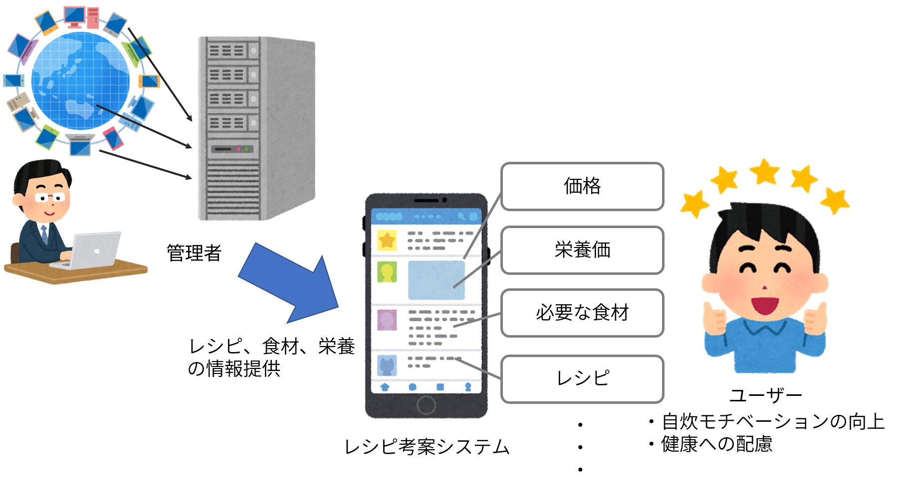

## 1.システムの目的
本システムの目的は，栄養バランスを考慮した料理のレシピや材料，材料費などを提案して，
一人暮らしの自炊の負担を軽減することである．

昨今のコロナ渦で，普段自炊をしないような一人暮らしの人でも自炊をせざるを得ない
状況が増えている．自炊に慣れていない人にとって，栄養バランスを考慮したメニューを考え，
材料を買いそろえて調理することは難しいと考えられる．
また一人暮らしの学生の場合は，食費を安く抑えることも重要な要素であり，
それらをすべて考慮して自炊を行うことは大きな負担になると考えられる．

そこで，栄養バランスを考慮した料理メニューを提案して，そのレシピや材料，材料費を提示する
システムをWebアプリケーションとして実装する．本システムの導入により，自炊の負担を軽減し，
また自炊に慣れていない人でも健康的な食生活を送ることが出来る．

## 2. システムの概要

本システムは、自炊を余儀なくされた一人暮らしの方のために、
栄養バランスを考慮したメニューを、その材料や材料費、作り方とともに
提案してくれるWebアプリケーションとして構築する。

下図(a)は、システム導入前の現状である。
値段と栄養を考慮したうえでのメニューの決定や、その材料を調べるのは、自炊をする本人がWebサイトなどを使って行っていた。

(a) システム導入前の現状

下図(b)はシステム導入後のあるべき姿である。
メニュー提案システムは、料理のメニュー、材料、材料費、栄養価、ユーザメニューから除外したい食材、をシステム内で管理するWebアプリケーションとして実装される。
ユーザはPCやスマホでWebブラウザを開き，システムにログインして、メニューの提案をうける。
システムは提案するメニューを一覧表示し、材料費や栄養価でソートする機能をもつ。

(b) システム導入による効果

システムの導入によってユーザは、低価格で栄養バランスのとれた料理のメニューの選択や,
その材料を調べる必要がなくなる。

## 3.機能一覧
1. ユーザ登録機能
- ユーザ登録を行う機能．
- 登録する情報はユーザID，パスワード，メールアドレス，嫌いなもの，アレルギー

2. ログイン機能
- ユーザがシステムを利用する際のログインを行う機能
- ログインはユーザIDとパスワードで行う
- ログイン後はユーザに対するメニュー提案（4. メニュー提案機能）が行われ，ユーザはメニューの選択，除外したい食材の登録（7. 除外食材登録機能），メニューのソート（8. メニューソート機能）が可能になる

3. メニュー管理機能
- システムがAPIを用いて外部サイトから献立の情報を取得・管理する機能
- 管理する情報はメニュー名，食材，レシピ，栄養価，価格

4. メニュー提案機能
- システムが管理しているメニューからメニューの提案・表示を行う機能
- システムはユーザ情報の嫌いなもの，アレルギーを参照して，それらを含まないメニューを提案する
- 表示する情報はメニュー名，食材，レシピ，栄養価，価格

5. 栄養価計算機能
- メニューに使われている各食材の栄養価からメニュー全体の栄養価を算出する機能

6. 価格算出機能
- メニューに使われている各食材の値段から調理にかかるおおよその金額を算出する機能

7. 除外食材登録機能
- ユーザが使用して欲しくない食材を登録する機能
- この機能で登録された食材を使ったメニューは提案されなくなる

8. メニューソート機能
- ユーザの選択に応じてシステムが提案するメニューをソートする機能
- ソートを行う際は，栄養価順でソートを行うか価格順でソートを行うか選択が可能

