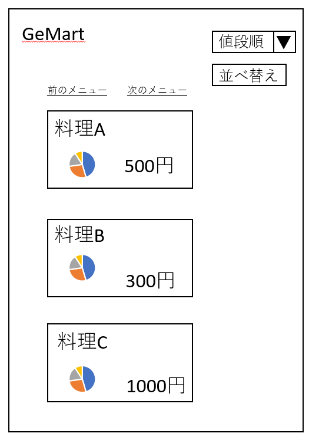
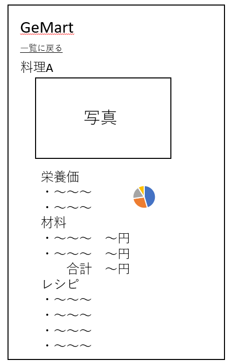

# ユースケース03：メニューを見る
## 概要
ユーザーがシステムから提案されたメニュー一覧から，作りたいメニューの詳細を見る
## アクター
- ユーザー
## 事前条件
- ユーザーがシステムにログイン済みであること
##  事後条件
- ユーザーが作りたいメニューの詳細を閲覧していること
## トリガー
- ユーザーがシステムにログインに成功する
## 基本フロー
1. ユーザーがログインに成功する.

2. システムは~~APIを用いて外部サイトからメニューの情報~~ユーザが指定済みの除外したい食材を取得する.

3. システムは除外したい食材を考慮して料理を取得する．

4. システムは~~メニュー~~料理の一覧を名称，写真，栄養価，価格付きで数十件表示する.

5. ユーザーは~~メニュー~~料理一覧から，作りたいメニューを選択する.

6. システムはユーザーが選択したメニューのレシピ，材料，栄養価，価格を表示する.

## 代替フロー
- 5a.1 基本フロー5で，ユーザーが他のレシピを見たい場合は，“次のメニュー”　(または“前の”メニュー)のリンクをクリックする．

- 5a.2 システムはクリックされたリンクに対応した~~メニュー~~料理一覧を取得して4に戻る．

- 6a.1 基本フロー6で，ユーザーがメニュー一覧に戻りたい場合は，”一覧に戻る”のリンクをクリックする．

- 6a.2 システムは4に戻る． 

## GUI紙芝居
### メニュー一覧画面

###  メニュー選択後の画面

