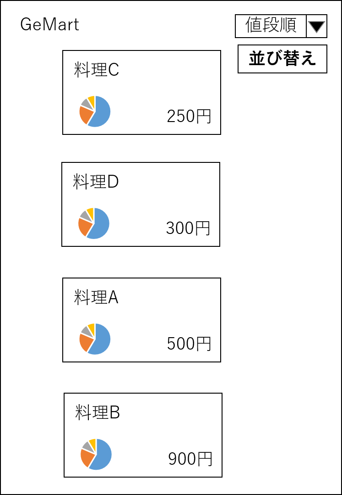

# ユースケース4：レシピ(メニュー)をソートする

## 概要
ユーザが，価格順，または栄養価順でレシピをソートするか選択し，レシピの表示順を変更する。

## アクター
- ユーザ

## 事前条件
- ユーザがレシピの一覧を表示している

## 事後条件
- ユーザが指定した条件でソートされたレシピの一覧が表示される

## トリガー
- ユーザが，レシピの一覧画面で「価格順に並び替え」ボタン，または「栄養価順に並び替え」ボタンを押す

## 基本フロー
1. ユーザが，レシピの一覧画面で「価格順に並び替え」ボタン，または「栄養価順に並び替え」ボタンを押す。
2. システムはユーザが押したボタンに応じて、提案されている料理から価格、または栄養価を取得する。
3. システムはユーザが押したボタンに応じて，レシピを価格の安い順，または栄養価の高い順に並び変える。
4. システムは並び替えたレシピをレシピの一覧画面に表示する。

## 代替フロー
### 代替フロー1
- 3a.1 基本フロー3で，ユーザがソートのかけられていないレシピの一覧を見たい場合には，「並び順を元に戻す」ボタンを押す。
- 3a.2 システムはソートがかけられていない状態のレシピを取得し，画面に表示する。

## GUI紙芝居
### レシピ提案画面（ソート前）

### レシピ提案画面（値段順でのソート後）
