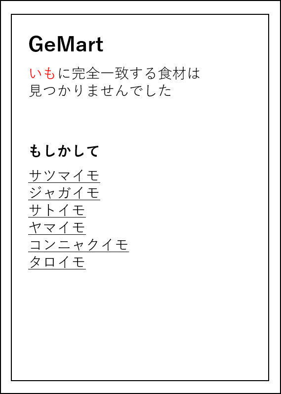

# ユースケース05：除外する食材を登録する
## 概要
ユーザが，料理の材料から除外する食材を登録する
## アクター
- ユーザ
## 事前条件
- ユーザがログインをしている
## 事後条件
- ユーザが除外したい食材がデータベースに登録されている
## トリガー
- ユーザが，メニュー閲覧画面で「除外食材リスト」ボタンを押す
## 基本フロー
- 1.ユーザが，メニュー閲覧画面で「除外食材リスト」ボタンを押す
- 2.システムは，除外食材リスト登録画面を表示する
- 3.ユーザは検索ボックスに除外したい食材の名称を記入する
- 4.システムは食材の名称から~~システム~~食材リストに登録された食材を検索し，その食材を，ユーザの除外したい食材として~~データベース~~ユーザの除外食材idリストに登録する．
- 5.システムは登録完了画面を表示する．なお，登録完了画上には「追加で登録ボタン」，「入力を終了」ボタンが存在する．
- 6.ユーザは「入力を終了」ボタンを押し，メニュー閲覧画面に戻る.
## 代替フロー
- 4a.1 基本フロー4において，ユーザの登録したい名前と似た名前の食材が存在し，~~システム~~食材リストに登録された食材が一意に検索できなかった場合，それらの食材を，一覧として画面に表示する
- 4a.2 ユーザは一覧の中から登録したかった食材をクリックし，基本フローの5にもどる
- 4b.1 基本フロー4において，ユーザの登録したい食材の名前から類推される食材が検索できなかった場合，検索ボックスの下に，赤字で「該当する食材がみつかりません．漢字の間違いなどに気をつけ，再度入力してください」と表示し，基本フローの3に戻る
- 5a.1 基本フロー5において，ユーザーが「追加で入力ボタンを」入力した場合は，基本フローの3に戻る
## GUI紙芝居
### 食材の候補の提案画面

