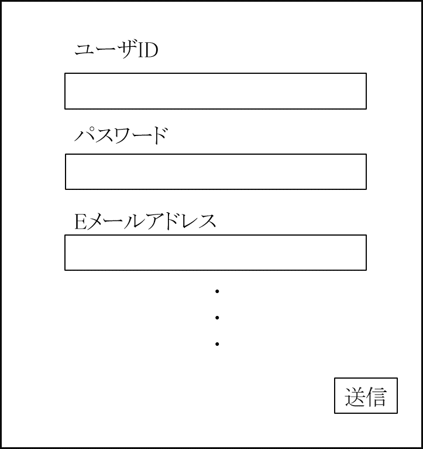

# ユースケース 1： アカウントを登録する

## 概要
ユーザがシステムにおいて，アカウントを登録する

## アクター
- ユーザ

## 事前条件
- ユーザのアカウントが未登録であること

## 事後条件
- アカウントがインターフェースに登録されている状態になる

## トリガ―
- ユーザがアカウント登録フォームを送信する

## 基本フロー
1. システムは,アカウント登録フォームを表示する
2. ユーザは,アカウント登録フォームに必要な情報を入力し、送信する
3. システムは,ユーザの入力した情報に基づいてアカウントが未登録であるかどうかや入力情報に不備がないかを確認する
4. 問題がなければ、システムはユーザのアカウントをインターフェースに登録する

## 代替フロー
### 代替フロー1
- 3a.1  基本フロー3において，入力情報に不備があった場合、システムは入力情報エラーを出し、2に戻る

## GUI紙芝居
### アカウント登録画面

